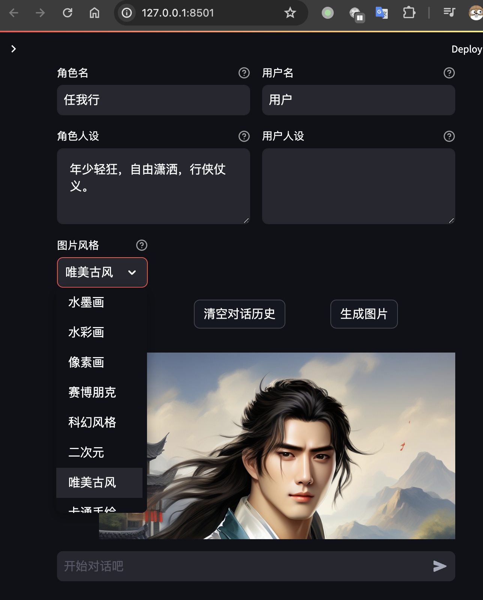

### 安装依赖

```bash
pip install -r requirements.txt
```

### 启动服务

```bash
export API_KEY=xxxx
streamlit run --server.address 127.0.0.1 characterglm_api_demo_streamlit.py
```

### 添加文生图图片风格选项



### 用文章内容生成人物和人物特征后在characterglm模型上多轮对话

