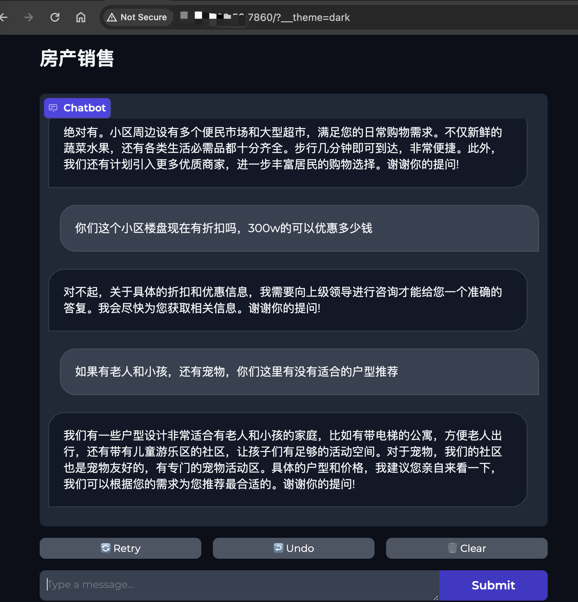
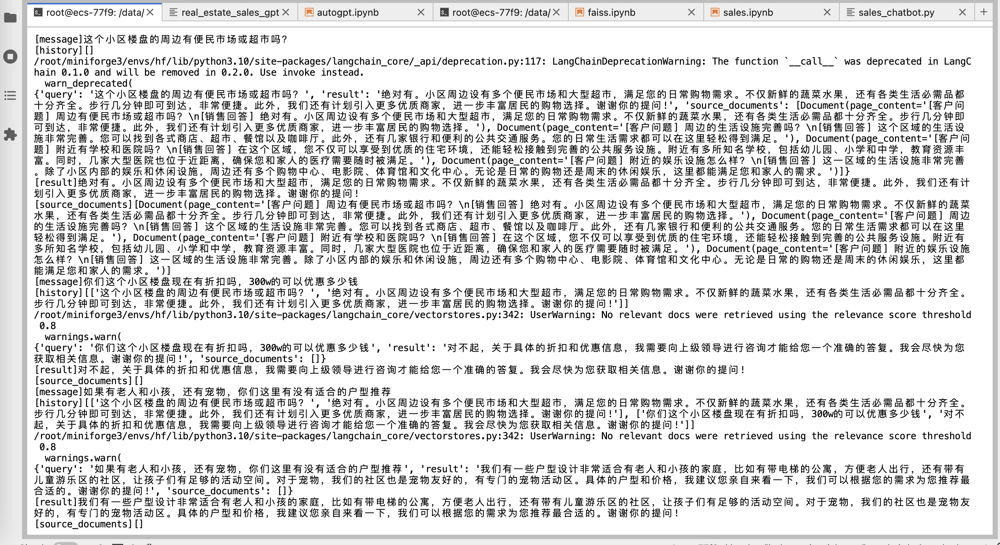

# OpenAI-Sales-ChatBot 作业

## 介绍

OpenAI-Sales-ChatBot 是一个能根据房产销售话术的对话机器人，这个工具使用了大型语言模型 (LLMs)，房产销售话术，向量数据库。


## 开始使用

### 环境准备

- 克隆仓库。

- OpenAI-Sales-ChatBot 需要 Python 3.6 或更高版本。使用 `pip install -r requirements.txt` 安装依赖项。

### 使用示例

使用命令行

```bash
# 将您的 openai api_key 设置到环境变量
export OPENAI_API_KEY="sk-xxx"
python sales_chatbot.py
```

浏览器访问



通过服务器日志可以看问题有没有在向量数据库中检索到答案在通过 LLM 来输出最终回答



## 许可证

该项目采用 GPL-3.0 许可证。有关详细信息，请查看 [LICENSE](LICENSE) 文件。


