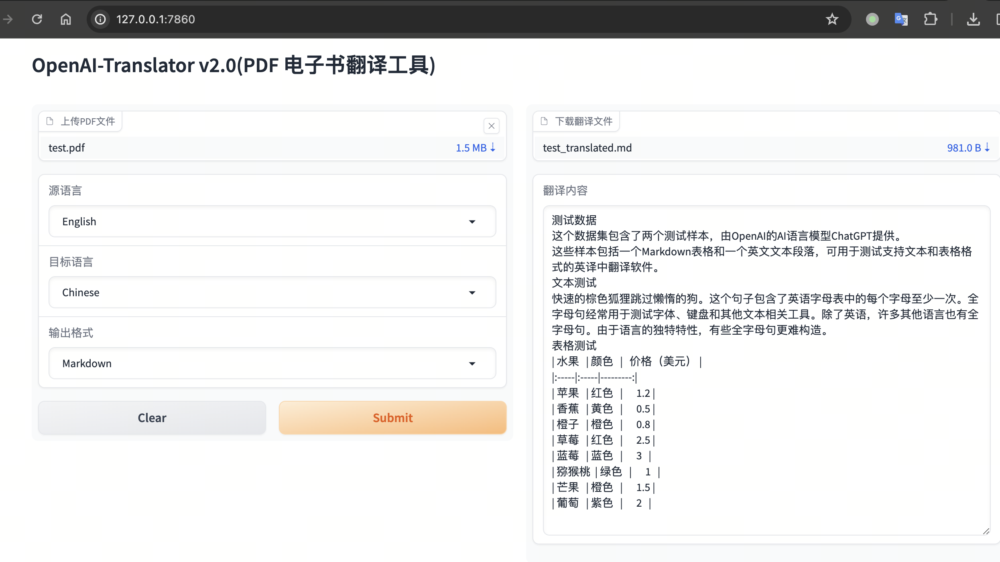

# OpenAI-Translator 作业

## 介绍

OpenAI 翻译器是一个使用 AI 技术将英文 PDF 书籍翻译成中文的工具。这个工具使用了大型语言模型 (LLMs)，如 ChatGLM 和 OpenAI 的 GPT-3 以及 GPT-3.5 Turbo 来进行翻译。它是用 Python 构建的，并且具有灵活、模块化和面向对象的设计。

## 特性

- [X] 使用大型语言模型 (LLMs) 将英文 PDF 书籍翻译成中文。
- [X] 支持 ChatGLM 和 OpenAI 模型。
- [X] 通过 YAML 文件或命令行参数灵活配置。
- [X] 对健壮的翻译操作进行超时和错误处理。
- [X] 模块化和面向对象的设计，易于定制和扩展。
- [X] 实现图形用户界面 (GUI) 以便更易于使用。
- [X] 添加对多个 PDF 文件的批处理支持。
- [X] 创建一个网络服务或 API，以便在网络应用中使用。
- [X] 添加对其他语言和翻译方向的支持。
- [X] 添加其他AI服务API的调用，通过配置支持。
- [ ] 添加对保留源 PDF 的原始布局和格式的支持。
- [ ] 通过使用自定义训练的翻译模型来提高翻译质量。


## 开始使用

### 环境准备

- 克隆仓库。

- OpenAI-翻译器 需要 Python 3.6 或更高版本。使用 `pip install -r requirements.txt` 安装依赖项。

### 使用示例

您可以通过指定配置文件或提供命令行参数来使用 OpenAI-翻译器。

#### 使用配置文件

根据您的设置调整 `config.yaml` 文件：

```yaml
OpenAIModel:
  model: "gpt-3.5-turbo"
  api_key: "your_openai_api_key"

ClaudeAIModel:
  model: "claude-3-haiku-20240307"
  api_key: "your_claude_api_key"

AzureOpenAIModel:
  model: "deployment-name"
  api_key: "your_openai_api_key"
  api_version: "api_version"
  api_url: "https://your-azure-openai-endpoint"

GLMModel:
  model_url: "your_chatglm_model_url"
  timeout: 300

common:
  book: "tests/test.pdf"
  file_format: "markdown"
```

设置您的 OpenAI API 密钥(`$OPENAI_API_KEY`)或 ChatGLM 模型 URL(`$GLM_MODEL_URL`)。您可以将其添加到环境变量中，或者在 config.yaml 文件中指定。

然后命令行直接运行：

```bash
python ai_translator/main.py
```


#### 使用命令行参数

您也可以直接在命令行上指定设置。这是使用 OpenAI 模型的例子：

```bash
# 将您的 api_key 设置为环境变量
export OPENAI_API_KEY="sk-xxx"
python ai_translator/main.py --model_type OpenAIModel --openai_api_key $OPENAI_API_KEY --file_format markdown --book tests/test.pdf --openai_model gpt-3.5-turbo
```

这是使用 GLM 模型的例子：

```bash
# 将您的 GLM 模型 URL 设置为环境变量
export GLM_MODEL_URL="http://xxx:xx"
python ai_translator/main.py --model_type GLMModel --glm_model_url $GLM_MODEL_URL --book tests/test.pdf 
```

### 其他模式使用示例

以 GUI 或者 API Serve 启动，调整配置参数文件，比如 `config_dev.yaml` 文件：

```yaml
model_name: "gpt-3.5-turbo" # gpt-3.5-turbo, gpt-4, claude-3-sonnet-20240229...
deployment_name: "" # azure openai model deployment name, e.g. openai-gpt4
api_type: "openai" # openai, claude, azure
input_file: "tests/test.pdf"
output_file_format: "markdown" # pdf, markdown
source_language: "English"
target_language: "Chinese"
```

根据配置，设置对应环境变量，比如：

```bash
# for openai
export OPENAI_API_KEY=
# for azure openai
export OPENAI_API_VERSION=
export AZURE_OPENAI_ENDPOINT=
export AZURE_OPENAI_API_KEY=
# for claude
export ANTHROPIC_API_KEY=
```

执行命令：

```bash
# GUI
python ai_translator/webui_server.py --config_file config_dev.yaml
# API Server
#python ai_translator/api_server.py --config_file config_dev.yaml
```



## 许可证

该项目采用 GPL-3.0 许可证。有关详细信息，请查看 [LICENSE](LICENSE) 文件。


